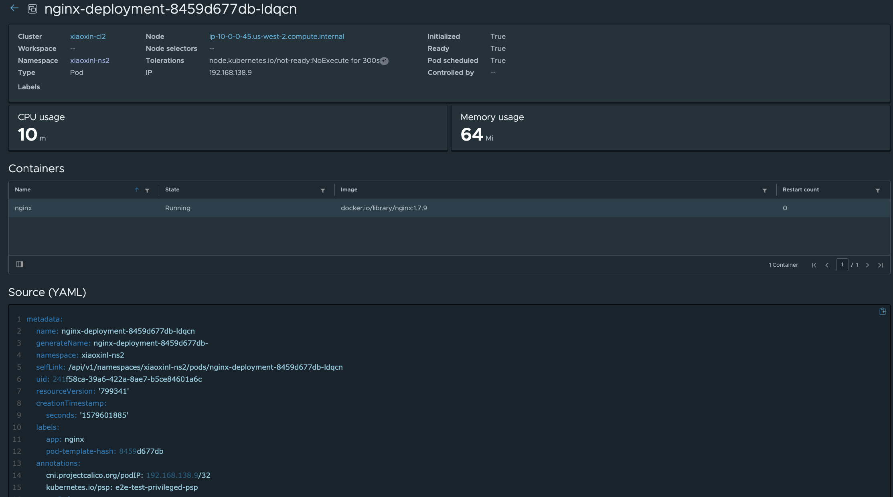

# Tanzu Mission Control - Fleet Diagnostics Lab Guide

**Contents:**

- [Tanzu Mission Control - Fleet Diagnostics Lab Guide](#tanzu-mission-control---fleet-diagnostics-lab-guide)
  - [Introduction](#introduction)
    - [Before Attempting This Lab:](#before-attempting-this-lab)
    - [Environment Pre-Requisites](#environment-pre-requisites)
  - [Scenarios](#scenarios)
    - [Scenario 1: Find clusters with most allocated resource](#scenario-1-find-clusters-with-most-allocated-resource)
      - [1.1: Go to the clusters list page](#11-go-to-the-clusters-list-page)
      - [1.2: Sort clusters by allocated memory or CPU](#12-sort-clusters-by-allocated-memory-or-cpu)
    - [Scenario 2: Check workloads of a specific cluster](#scenario-2-check-workloads-of-a-specific-cluster)
      - [2.1: Locate the cluster](#21-locate-the-cluster)
      - [2.2: Check the workloads](#22-check-the-workloads)
        - [option #1: Click "Workloads" from the cluster overview page.](#option-1-click-%22workloads%22-from-the-cluster-overview-page)
        - [option #2: Go the workloads list page in the left hand of main page and filter by cluster name.](#option-2-go-the-workloads-list-page-in-the-left-hand-of-main-page-and-filter-by-cluster-name)
      - [2.3: Check specific workload](#23-check-specific-workload)
    - [Scenario 3: Check cluster health](#scenario-3-check-cluster-health)
      - [3.1: Check fleet health](#31-check-fleet-health)
      - [3.2: Check specific cluster health](#32-check-specific-cluster-health)
      - [3.3: Diagnose unhealthy cluster](#33-diagnose-unhealthy-cluster)
    - [Scenario 4: Manage your workloads when you don't have access to cluster](#scenario-4-manage-your-workloads-when-you-dont-have-access-to-cluster)
      - [4.1: Find your workloads from main page](#41-find-your-workloads-from-main-page)
      - [4.2: Find your workloads from workspace](#42-find-your-workloads-from-workspace)
    - [Validate Lab Guide](#validate-lab-guide)

## Introduction

This document is intended to show how you can use TMC UI to manage all your clusters and workloads with regard to different personas (platform operator, infrastructure operator, application operator, application developer); and drill down to a specific cluster to investigate cluster health and workloads running in the cluster. 

### Before Attempting This Lab:

This lab has a completion difficulty of `Partial`. Please see the rubrik below for an explanation of lab completion difficulty rankings

Lab Completion Difficulty Rankings:

- Difficulty Levels:
  - `Complete`
    - A lab guide with a difficulty of `Complete` includes comprehensive, click-by-click instructions, usually with a screenshot for every command entered. Complete labs must be associated with an online lab environment fully prepped to execute the exact instructions provided in the lab guide. Most users could successfully execute the steps in a `Complete` lab guide, even if they do not have expertise in the subject, by following detailed instructions.
  - `Partial`
    - A lab guide with a difficulty of `Partial` includes full instructions to complete the exercise, with enough detail to where a user with moderate experience in the subject matter could complete the exercise. `Partial` lab guides provide a level of detail similar gto most typical technical documentation, where the user is expected to be able to configure their lab environment with dependencies required for the exercise, and to contextualize general instructions to the users own environment. 
  - `Challenge`
    - A lab guide with a difficulty of `Challenge` is designed to be technically challenging for the guide's target audience to complete. `Challenge` lab guides do not include comprehensive instructions, and intentionally leave out details required to complete exercises as a challenge or test of the users proficiency in a topic.

### Environment Pre-Requisites

The demo in this document is conducted with a development TMC stack with several attached clusters and provisioned clusters.

## Scenarios

### Scenario 1: Find clusters with most allocated resource

As a platform operator or infrastructure operator, you might want to check which clusters have most resource allocated.

#### 1.1: Go to the clusters list page

Screenshot

All clusters in your organization are displayed here.

Question: Is there any other cluster properties you'd like to see in this cluster list? 

Tip: In case "Allocated memory" and "Allocated CPU" columns are hidden, click the column icon in the bottom left corner of the cluster list grid. Then select these two columns in the column list.

Screenshot

#### 1.2: Sort clusters by allocated memory or CPU

TMC provides you an option to sort clusters by cluster name, status, health, version, allocated memory & CPU and number of nodes. As an example, click "Allocated memory" twice to sort the clusters by decreasing order to find the clusters with most allocated memory. Then you can click into any cluster for further investigation.

Screenshot

### Scenario 2: Check workloads of a specific cluster

If you are an infrastructure operator and you want to check the workloads of a specific cluster, here are the steps.

#### 2.1: Locate the cluster

In the clusters list page, you may filter the clusters by cluster name, status and version to help you to quickly locate the cluster you're interested in.

Screenshot

Click the cluster and go to its overview page.

Screenshot

Question: Is there any other cluster properties you'd like to see in this cluster overview page?

#### 2.2: Check the workloads

##### option #1: Click "Workloads" from the cluster overview page.

Screenshot

Question: Is there any other workload properties you'd like to see in this workload list? 

##### option #2: Go the workloads list page in the left hand of main page and filter by cluster name.

Screenshot

Note there is option in the upper right corner to hide Tanzu objects and system objects.

Screenshot

It can help you focus on your production workloads. Now you may route to any specific workload from here.

#### 2.3: Check specific workload

From the workloads pane, select the nginx-deployment workload:

Screenshot

It shows workload information including which namespace it belongs to, CPU & memory usage, the pods inside the workload and its source yaml file. You may also check specific pod by clicking its name.

Screenshot

Question: Is there any other workload information that you find missing?

### Scenario 3: Check cluster health

If you are a platform operator or infrastructure operator, you may need to check if your clusters or a specific cluster is healthy.

#### 3.1: Check fleet health

Go to the clusters list page, sort the clusters by "Health" column.

Screenshot

#### 3.2: Check specific cluster health

After you locate the cluster that you'd like to explore in the cluster list page, click the cluster to go to its overview page. A cluster is healthy when all of its components (controller-manager, etcd, api-server and scheduler) are healthy and all worker nodes are healthy.

Screenshot

Question: Do you consider factors other than component health and worker node health to decide whether a cluster is healthy? 

#### 3.3: Diagnose unhealthy cluster

Assume you find a cluster is in a warning state in cluster list page, let's find out what goes wrong with this cluster. Click the cluster and land in the following page. Here you will notice that a worker node is in a warning state. Let's click Nodes tab to dig deeper.

Screenshot

1 node is in warning state! Let's choose that node and see what triggered the warning.

Screenshot

Hover over each node condition and noticed that this node has disk pressure. Now you find out the root cause and can take actions to fix it. 

Screenshot

### Scenario 4: Manage your workloads when you don't have access to cluster

If you are an application operator or application developer, you may have access to your workspace and namespaces but don't have cluster-wide access. The clusters overview may look like this to you:

Screenshot

Are you still able to see your workloads? The answer is yes. Here's how:

#### 4.1: Find your workloads from main page

Please see screenshots below:

Screenshot

Sorting/Filtering by workload name, object, cluster name, namespace name, labels and create time are supported. You are able to click each individual workload to manage it.

Screenshot

#### 4.2: Find your workloads from workspace

Please see screenshots below:

Screenshot

You can also get your workloads here. Click "Workloads".

Screenshot

### Validate Lab Guide

If you were able to complete this lab successfully without any significant problems, please sign the [validate.md](./validate.md) file located in this directory. 

If you encountered any problems or have suggestions or feature requests, please open an issue ticket on this repository. 

If you have any updates or improvements for this lab guide, please open a PR with your updates.

**Thank you for completing the Tanzu Mission Control - Fleet Diagnostics Lab Guide!**